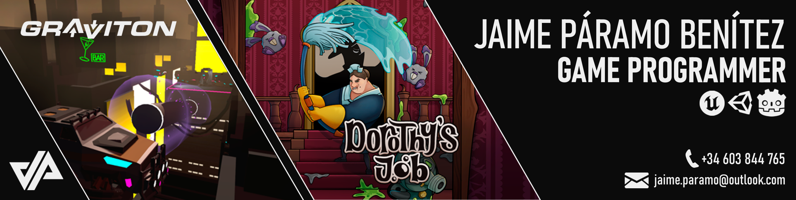

  

 

# 👋 About Me:

🎮 From an early love for video games and music, I decided to pursue a career where creativity and logic meet. My journey began with a Bachelor’s Degree in Game Design at U-tad, where I specialized in technical design and developed a solid understanding of game design, production, and development using tools such as Unreal Engine, Unity, Godot, FMOD, Maya, and the Adobe Suite. During this time, I received a scholarship that allowed me to join the university’s research team, deepening my analytical and collaborative skills.

👨‍🏫 Alongside my studies, I discovered a genuine interest in education. For three consecutive years, I worked as a game development teacher at U-tad’s Summer School, guiding young students through their first experiences with Unreal Engine 5 and helping them turn ideas into playable projects.

💻 To strengthen my technical foundation, I pursued a Master’s in Game Programming at U-tad, where I specialized in C++ and Unreal Engine 5, focusing particularly on UI and audio programming. For our final project, Dorothy’s Job, I served as UI, audio, and gameplay programmer, developing systems that supported core gameplay logic.

🎵 With over a decade of background in music theory and piano, I find joy in blending creativity and technology to bring interactive experiences to life. Today, I aim to grow as a gameplay systems programmer, focusing on UI and audio, where code and design truly connect.

## 🌐 Links

## 🛠 Tech Stack

### 🎮 Game Engines

### 💻 Programming Languages

### 🎧 Audio

### 🔨 Tools

### 🌐 Web Development

